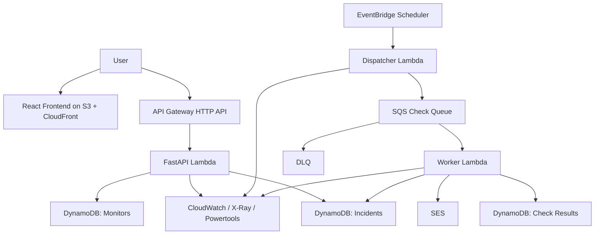

# LinkGuard Project
Last updated: 2026-03-24

## What this file is
This is the compact working contract for LinkGuard.

Use it when:
- context is running out
- a new coding session starts
- you need scope, architecture, and priorities quickly

Related docs:
- `README.md`: public overview
- `docs/architecture.md`: deeper system design
- `docs/backend.md`: backend slice notes
- `docs/decision-log.md`: decision rationale
- `private/LINKGUARD_OWNER_BRIEF.md`: private owner notes, not tracked

## Project in one sentence
LinkGuard is an AWS-native service that monitors revenue-critical links, opens incidents only after repeated failures, and alerts users with enough evidence to act.

## Product thesis
This is not generic uptime monitoring and not "AI for ops." It is a narrow reliability product for creators, solo operators, and small businesses that have a few pages directly tied to revenue.

The promise is:
- monitor the pages that matter financially
- reduce noise by requiring repeated failure
- preserve evidence from each check
- keep the system cheap and explainable

## Target user
Primary users:
- creators
- solo operators
- small businesses
- small internal teams with a few "money pages"

What they care about:
- fast detection
- low noise
- low cost
- simple explanation of what failed

## Current maturity
Current state: early MVP implementation.

Real today:
- public GitHub repo
- public architecture and decision docs
- FastAPI local control plane
- monitor lifecycle endpoints
- local HTTP check execution
- incident open / resolve logic
- local result history
- React/Vite frontend shell
- Terraform scaffold

Not real yet:
- deployed AWS resources
- DynamoDB persistence
- queue-backed worker execution
- SES email sending
- polished dashboard flows
- CI/CD deploy path
- production observability

## V1 scope
In scope:
- HTTP GET checks
- expected status code validation
- optional body substring validation
- fixed intervals: 1, 5, 15, 60 minutes
- incident open after repeated failure
- incident resolve after repeated recovery
- email alerts as first channel
- basic monitor and incident dashboard

Out of scope:
- browser automation
- screenshots
- login/session flows
- SMS
- AI summaries
- billing
- multi-region failover
- Kubernetes
- ECS-first deployment

## Target production architecture

## Why this architecture
Lambda over ECS:
- bursty, event-driven workload
- low ops overhead
- enough for API, dispatcher, and worker roles

One scheduler plus a dispatcher:
- simpler than one schedule per monitor
- easier to explain and debug in v1

SQS in the middle:
- buffers spikes
- decouples scheduling from execution
- supports retries and DLQ behavior

DynamoDB first:
- low-ops fit for monitor, incident, and result state
- cheaper than relational infra for this MVP

SES first:
- real alerting path without integration sprawl

## Current local implementation
Today, the system is proving domain behavior before cloud plumbing:
- FastAPI routes expose the control plane
- monitoring service applies incident rules
- checker service performs HTTP checks
- dispatcher service produces due job payloads
- in-memory repository stores monitors, results, and incidents

This is intentional. The local app is proving behavior, not pretending to be production.

## Current backend surface
Implemented endpoints:
- `GET /health`
- `POST /monitors`
- `GET /monitors`
- `GET /monitors/{monitor_id}`
- `POST /monitors/{monitor_id}/pause`
- `POST /monitors/{monitor_id}/resume`
- `GET /monitors/{monitor_id}/results`
- `POST /monitors/{monitor_id}/run-check`
- `GET /dispatch/due-jobs`
- `GET /incidents`

Implemented behaviors:
- monitor creation with interval validation
- due monitor detection
- pause and resume behavior
- HTTP check execution
- failure classification
- local result persistence
- incident open after 2 consecutive failures
- incident resolve after 2 consecutive successes

## Reliability policy
These are product decisions, not incidental implementation details:
- allowed intervals are `1`, `5`, `15`, `60`
- first failure records evidence only
- second consecutive failure opens incident
- additional failures update the open incident
- second consecutive success resolves incident
- paused monitors are excluded from dispatch

Current failure types:
- `timeout`
- `connection`
- `status_mismatch`
- `content_mismatch`
- `internal_error`

## Component boundaries
Backend ownership:
- `app/domain.py`: shared product language and policy constants
- `app/routes/`: HTTP layer only
- `app/services/checker.py`: run checks and classify results
- `app/services/monitoring.py`: apply incident state rules
- `app/services/dispatcher.py`: create queue-style jobs for due monitors
- `app/services/repository.py`: storage adapter boundary

Rule:
- routes stay thin
- business logic lives in services
- storage remains swappable

## Data model direction
Core entities:
- monitors
- check results
- incidents

Monitor fields that matter:
- target URL
- interval
- timeout
- expected status
- expected substring
- alert destination
- status
- next check time
- consecutive failure/success counters

Check result fields that matter:
- check time
- health status
- latency
- HTTP status
- failure type
- normalized reason
- response excerpt

Incident fields that matter:
- open / resolved state
- opening reason
- failure count
- last observed status
- timestamps

## Major decisions already made
- Lambda first, not ECS
- one scheduler trigger, not one schedule per monitor
- SQS between dispatch and execution
- DynamoDB for first production persistence
- SES as first alerting channel
- local-first backend before AWS integration
- HTTP GET plus status/body match for first check type
- incident open after 2 failures and resolve after 2 successes

## Major decisions still to make
- DynamoDB table design and access patterns
- queue payload shape and idempotency key format
- exact email alert content
- whether recovery emails ship in v1
- when auth enters the system
- when the frontend becomes product-bearing

## What is missing before the MVP is real
Technical gaps:
- DynamoDB adapter
- EventBridge Scheduler wiring
- SQS and DLQ wiring
- worker Lambda execution path
- SES send path
- Terraform resource implementation
- GitHub Actions + OIDC deploy flow
- CloudWatch alarms and traces

Product gaps:
- create monitor UI
- monitor list UI
- incident feed UI
- result history UI
- end-to-end demo path for a non-technical user

## Recommended build order
1. finalize DynamoDB access patterns
2. implement Terraform for core AWS resources
3. wire dispatcher -> SQS -> worker
4. swap repository boundary to DynamoDB
5. add SES incident-open emails
6. add basic dashboard flows
7. add observability
8. add CI/CD with GitHub Actions + OIDC

## MVP success criteria
The MVP is real only when all of this works:
- monitor is created in a deployed environment
- scheduler finds it due
- dispatcher enqueues a job
- worker executes a real check
- result is stored durably
- repeated failures open an incident
- SES sends an incident email
- recovery resolves the incident
- dashboard shows current monitor and incident state

## Working rules
- keep this file compact and current
- update it when a major decision changes
- do not add speculative features here
- do not confuse local implementation with target production architecture
- if context is lost, start here before reading deeper docs
