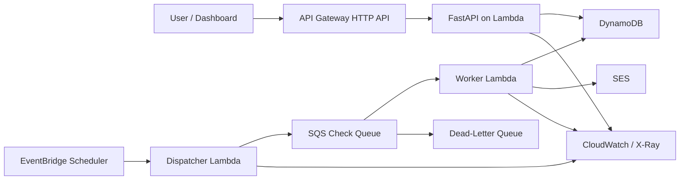
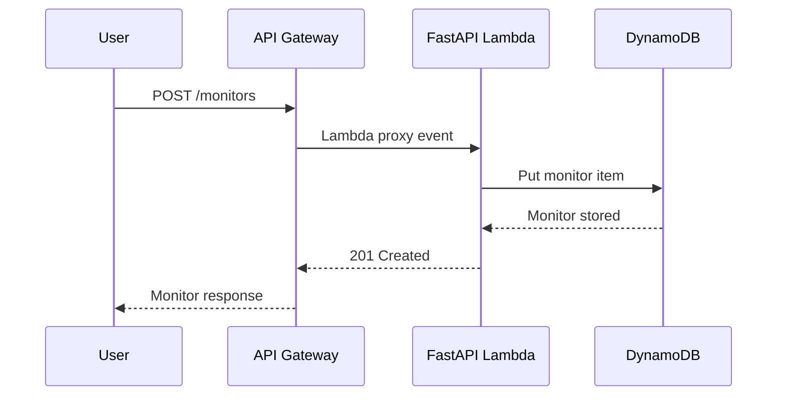
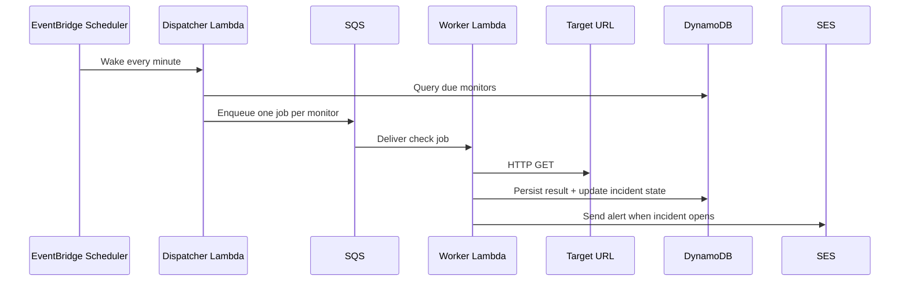

# LinkGuard Architecture

## Problem and user

LinkGuard exists for one narrow but expensive failure mode: a creator or small business has a revenue-critical page break, and they only find out after customers start dropping off. The user is not an SRE team buying a broad observability suite. The user is a small operator who needs incident-style monitoring for a handful of pages that matter financially.

## System goal

The goal of v1 is not generic uptime monitoring. The goal is to detect repeated failures on money pages, reduce noisy one-off alerts, and surface enough evidence that the user can act quickly.

## V1 component map

## Why each service exists

### API Gateway HTTP API

- Public entry point for monitor CRUD and incident reads.
- Keeps the control plane separate from worker execution.
- Good enough for a small, serverless API without REST API cost or complexity.

### FastAPI on Lambda

- Control-plane compute for monitor lifecycle and local-first iteration.
- Easy to test locally and still maps cleanly to Lambda with Mangum.
- Strong fit for low-traffic admin operations and a small product surface.

### EventBridge Scheduler

- Fires one dispatcher every minute.
- Avoids the complexity of managing one schedule object per monitor in v1.
- Keeps schedule ownership centralized and easy to explain.

### Dispatcher Lambda

- Reads monitors due for execution.
- Emits one check job per due monitor into SQS.
- Exists to separate "when should work happen" from "do the work."

### SQS + DLQ

- Buffers spikes if many monitors are due at once.
- Preserves failed jobs for retry and diagnosis.
- Gives a clean place to discuss backpressure, retries, and dead-letter behavior in interviews.

### Worker Lambda

- Performs the actual HTTP check.
- Normalizes failure reasons into a small taxonomy.
- Updates results and incident state atomically at the application layer.

### DynamoDB

- Stores monitors, check history, and incidents.
- Fits the v1 access patterns better than a relational database that would mostly be used as key-value storage.
- Supports TTL for aging out check history without a cleanup job.

### SES

- First real alerting channel.
- Enough to close the loop from detection to notification.
- Cheaper and simpler than building multiple integrations immediately.

### CloudWatch, X-Ray, and Powertools

- Metrics: queue depth, check latency, worker errors, incident opens.
- Tracing: request flow and queue-to-worker execution path.
- Structured logs: enough evidence to debug the reliability product itself.

## Request and execution flows

### Control-plane flow

### Monitoring flow

## Backend module boundaries

- `routes/`: HTTP contract only. No decision-heavy business logic.
- `services/checker.py`: perform and classify HTTP checks.
- `services/monitoring.py`: apply incident policy and mutate monitor state.
- `services/dispatcher.py`: expose the queue payload contract.
- `services/repository.py`: storage abstraction for local-first development.
- `domain.py`: product language and policy constants.

This split matters because it keeps the interview story clean: route handlers are thin, policies live in one place, and storage can change without rewriting business logic.

## Data model

### Monitors

Fields the system needs to know when and how to check a page:

- `monitor_id`
- `name`
- `target_url`
- `interval_minutes`
- `timeout_seconds`
- `expected_status_code`
- `expected_substring`
- `alert_email`
- `status`
- `consecutive_failures`
- `consecutive_successes`
- `next_check_at`

### Check results

Each result is evidence, not just a boolean:

- `check_id`
- `monitor_id`
- `checked_at`
- `status`
- `latency_ms`
- `http_status`
- `failure_type`
- `reason`
- `response_excerpt`

### Incidents

The incident record captures the noisy-to-actionable boundary:

- `incident_id`
- `monitor_id`
- `state`
- `opening_reason`
- `failure_count`
- `last_observed_status`
- `last_reason`
- `opened_at`
- `resolved_at`

## Reliability policy

These are product decisions, not implementation accidents:

- Allowed check intervals are `1`, `5`, `15`, and `60` minutes only.
- An incident opens after `2` consecutive failures.
- An incident resolves after `2` consecutive successes.
- Paused monitors are excluded from dispatch.
- Failure reasons are normalized into `timeout`, `connection`, `status_mismatch`, `content_mismatch`, and `internal_error`.

Those rules are what make LinkGuard feel operational rather than like a generic cron job.

## Cost and scope discipline

The architecture is intentionally conservative because this project needs to be cheap and explainable.

Cost controls:

- Lambda instead of always-on compute
- one shared scheduler instead of a complex control plane
- DynamoDB TTL for check history later
- short CloudWatch retention in non-prod
- only a few supported intervals in v1
- email-only alerting at the start

Out of scope for the first 2 weeks:

- browser automation
- screenshots
- login/session flows
- SMS
- AI-generated root-cause summaries
- billing
- multi-region failover
